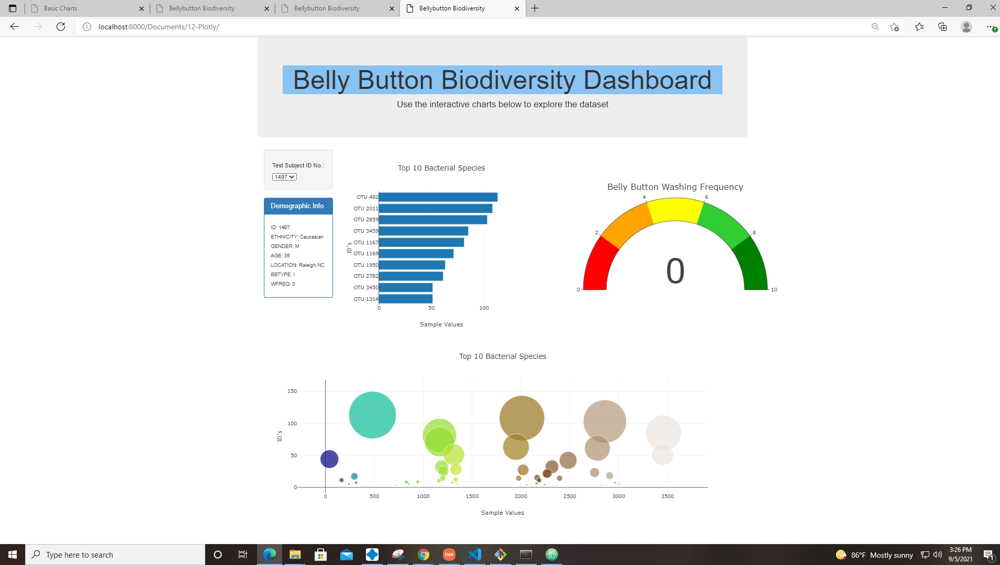

# BellyButton Biodiversity with Plotly

## Purpose
Roza has a partially completed dashboard that she needs to finish. She has a completed panel for demographic information and now needs to visualize the bacterial data for each volunteer. Specifically, her volunteers should be able to identify the top 10 bacterial species in their belly buttons. That way, if Improbable Beef identifies a species as a candidate to manufacture synthetic beef, Roza's volunteers will be able to identify whether that species is found in their navel.

## Results
Using HTML, javascript, and plotly, I created a customized dashboard with a bar, bubble, and guage chart for different types of bacteria found in the test subjects bellybuttons.  The dashboard is able to be filtered by the Test Subject ID and returns data unique to that id.

### Home Page

### Test Search 1 (Test Subject ID # 959)

### Test Search 2 (Test Subject ID #1497)
